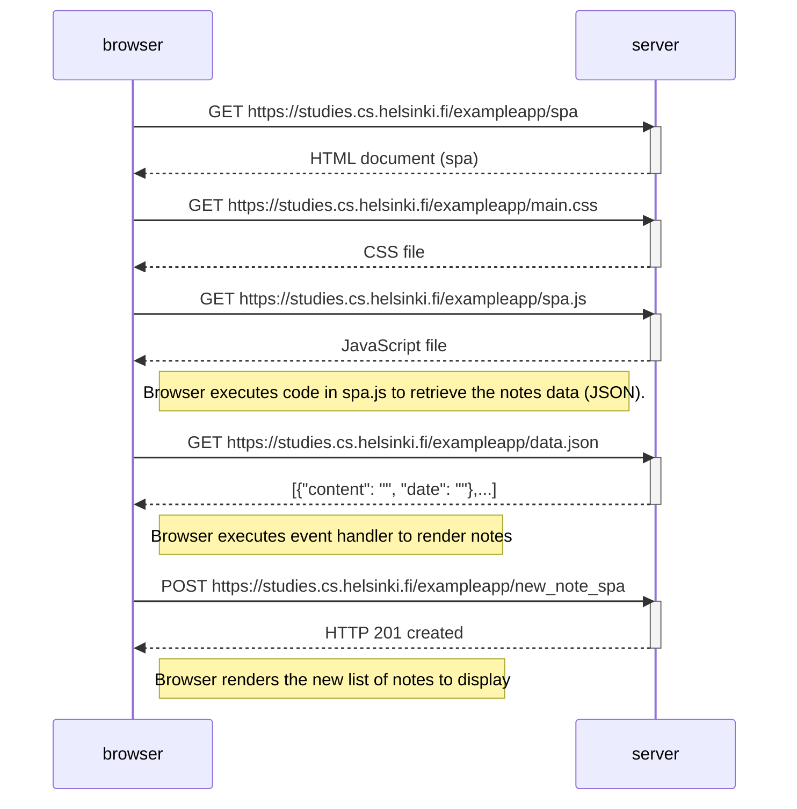

```mermaid
sequenceDiagram
	participant browser
	participant server

	browser->>server: GET https://studies.cs.helsinki.fi/exampleapp/spa
	activate server
	server-->>browser: HTML document (spa)
	deactivate server

	browser->>server: GET https://studies.cs.helsinki.fi/exampleapp/main.css
	activate server
	server-->>browser: CSS file
	deactivate server

	browser->>server: GET https://studies.cs.helsinki.fi/exampleapp/spa.js
	activate server
	server-->>browser: JavaScript file
	deactivate server

	Note right of browser: Browser executes code in spa.js to retrieve the notes data (JSON).

	browser->>server: GET https://studies.cs.helsinki.fi/exampleapp/data.json
	activate server
	server-->>browser: [{"content": "", "date": ""},...]
	deactivate server

	Note right of browser: Browser executes event handler to render notes

	browser->>server: POST https://studies.cs.helsinki.fi/exampleapp/new_note_spa
	activate server
	server-->>browser: HTTP 201 created
	deactivate server

	Note right of browser: Browser renders the new list of notes to display
```
